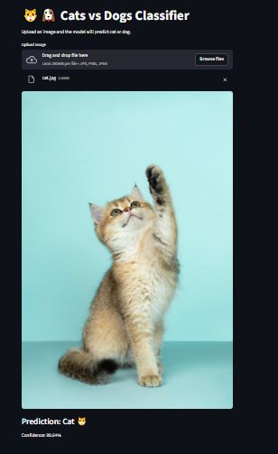
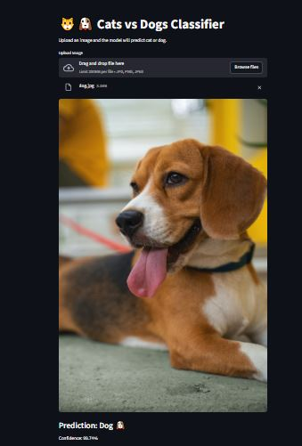

[Click the Streamlit_app](https://cat-dog-pred-rsr3newzqqbqfg78rvudiw.streamlit.app/) 

# 🐱🐶Cats vs Dogs Image Classifier

*Custom MobileNetV2 model classifying cat 🐱 vs dog 🐶 images, deployed as an interactive Streamlit web app for real-time predictions.*

***Mechanism:***: (Upload an image → Get instant prediction with confidence!)

***🎯 Aim***
Build and deploy a lightweight computer vision model using transfer learning to distinguish cats from dogs with ~98% test accuracy.

***🧩 Key Features***
- Efficient Model: Fine-tuned MobileNetV2 (ImageNet pretrained).

- Real-Time Web App: Streamlit UI for image uploads and predictions.

- High Accuracy: Cross-entropy loss + Adam optimizer.

- Easy Deploy: One-click setup; works on Streamlit Cloud.

# ***📂 Dataset***
Kaggle Cats and Dogs (~25k images):

## 📁 dataset Structure
```
cats-and-dogs/
├── training/
│   ├── cats/      # 8k+ images
│   └── dogs/
└── test/
    ├── cats/      # 2k images
    └── dogs/
```
    
***⚙️ Quick Setup***
Clone & install:

git clone [Link Text](https://github.com/HARDECOMM/cat-dog-pred.git)
cd cat-dog-pred
pip install -r requirements.txt
Add your trained model: ***model/cat_dog_model.pth***

***Run:*** streamlit run app.py

Streamlit Cloud: Fork → Connect repo → Deploy (free!).

## 🧠 Model Breakdown
- Architecture: MobileNetV2 backbone (frozen features) + custom 2-class head.

- Preprocessing: Resize to 224 × 224.

- Inference: Argmax on softmax probabilities.

- Perf: ~98% test accuracy (varies by epochs/dataset).

- Input Image → MobileNetV2 → [0.99 Dog, 0.99 Cat] → 🐶 Dog (99%) & Cat (99%)

 


## 📁 Project Structure
```
cats-dogs-streamlit/
├── model/              ## cat_dog_model.pth
├── app.py             ## Streamlit app
├── requirements.txt   ## Dependencies
└── README.md          ## Project docs
```

## 📊 ***Results***
Metric	Value
Test Acc.	98%
Inference	<1s
Model Size	9MB

## ***Shortcomming***
Despite the accuracy, the model confuse with uncleared dataset 
- as a result ensure you add more features to cover diverse set of features
- also ensure feed the model with cleared image of dog or cat

## ***🔗 Resources***

PyTorch ImageFolder
MobileNetV2
dogs & cat Dataset

Built with ❤️ for computer vision portfolios. Star if useful! ⭐
